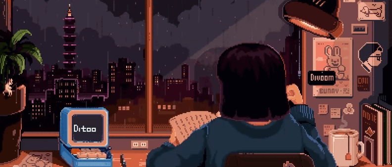

<h3 align= "center"> Hello World 👋🏼 i'm VXDB</h3>

<i align="center">

</i>
Here's some facts about me:
 
- Only self-study.
- Using Renpy, I'm writing a mod for the game.
- I have been interested in IT for more than 4 years.

<h4 align="center">Contact with me on TG: @isvxdb</h4>
